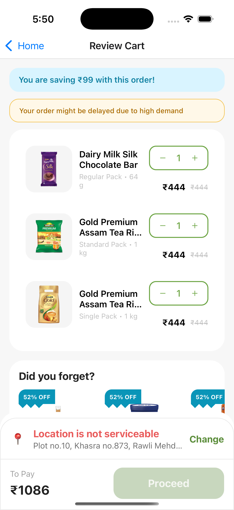

# React Native Cart Flow Assignment – Aforro

## App Demo

Click below to watch full demo of the cart flow implementation:

  

## Overview

This project implements a complete cart flow experience in React Native based on the provided Figma design.

The focus of this assignment was not limited to UI implementation. It aims to replicate a real-world quick commerce cart system, handling multiple user scenarios such as product selection, cart management, delivery conditions, coupon application, and checkout readiness.

The implementation follows a clean architecture, reusable component design, and proper state handling to simulate a production-level application.

---

## Assignment Reference

- Objective: Implement complete cart flow from Figma
- UI Accuracy: Strict adherence to spacing, typography, and layout
- Logic: No hardcoded values; all calculations are dynamic

Reference Document:  
React Native Technical Assignment – Aforro  
(Refer to the shared assignment PDF)

---

## Tech Stack

- React Native (CLI / Expo)
- TypeScript
- Functional Components with Hooks
- Context API for state management
- Modular architecture with reusable components

---

## Complete User Flow

### 1. Product Interaction

Users can:
- Add a product directly
- Select product variants using bottom sheet

Behavior:
- If product has options → Bottom sheet opens
- If not → Product is added directly to cart

---

### 2. Product Options Bottom Sheet

This handles variant selection.

Features:
- Multiple product variants
- Quantity selection per variant
- Dynamic pricing
- Confirm action to add to cart

---

### 3. Cart Screen

The cart screen acts as the central control layer of the application.

Sections include:
- Header
- Savings banner
- Warning banner (if applicable)
- Cart items
- Suggested products
- Coupon section
- Delivery instructions
- Price breakdown
- Address section
- Final checkout CTA

---

## Core Logic and Conditional Flows

### Cart State
- Empty cart → Empty state UI
- Filled cart → Render items and summary

---

### Product State
- Available → Normal interaction
- Out of stock → Warning shown and restricted actions

---

### Quantity Management
- Increment and decrement update:
  - Individual item price
  - Cart total
  - Savings

Handled using reusable component:
- QuantityStepper

---

### Coupon Handling

States:
- Not applied → User can apply coupon
- Applied → Coupon highlighted
- Discount reflected in total

---

### Delivery Mode Logic

Two delivery types are supported:

#### Instant Delivery
- Available for nearby locations
- Estimated delivery: 30–60 minutes

#### Slot Delivery
- Used when instant delivery is unavailable
- User selects preferred time slot

---

### Address Handling

Scenarios:
- Address available → Display address with change option
- No address → Prompt to add address
- Not serviceable → Disable checkout with error message

---

### Login State

- Logged-in user → Can proceed normally
- Guest user → Prompt to login before checkout

---

### Price Calculation

All values are dynamically computed:

- Item total
- Discount
- Delivery fee
- Platform fee
- Final payable amount

No hardcoded values are used.

---

## Reusable Components

The application is built with reusable UI components:

- CartItemCard → Displays cart items
- QuantityStepper → Handles quantity changes
- CouponCard → Displays coupon UI
- DeliveryAddressSection → Handles address logic
- ProductSuggestionCard → Horizontal product list
- InfoBanner → Displays savings and messages

---

## Design System

### Colors
- Primary green for actions
- Blue for informational banners
- Orange for alerts and coupon highlights

---

### Spacing
- Screen padding: 16
- Card padding: 12–16
- Consistent vertical spacing across sections

---

### Typography
- Titles: Bold
- Product names: Medium
- Supporting text: Regular/light

---

## Performance Considerations

- FlatList used for rendering lists
- Component reusability minimizes re-renders
- Efficient state updates
- Modular architecture for future scaling

---

## Testing Guide for Reviewers

The application is designed so that all flows can be tested easily.

### Product Flow
- Add simple product
- Add product with variants

---

### Cart Updates
- Increase and decrease quantity
- Verify real-time total updates

---

### Coupons
- Apply coupon
- Switch between coupons

---

### Delivery Modes
- Test instant delivery
- Test slot delivery

---

### Address Handling
- Add Default address
- Remove address
- Test non-serviceable location

---

